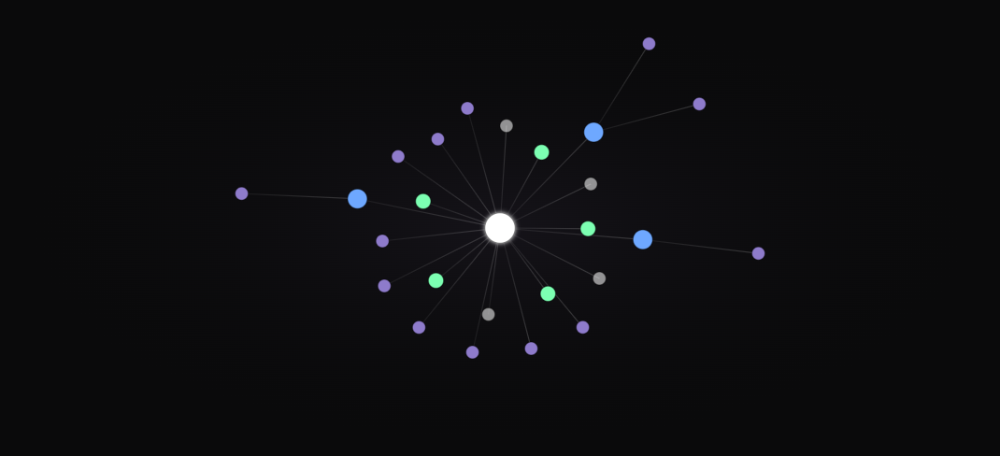

# 🔁 Loop — Meeting Brief & De-brief Agent

> An AI agent that **briefs you before every meeting**, **learns from you after**, and **rewrites your team's shared memory in real time** — right inside Slack.

<p align="left">
  
  
  
  
  
  
</p>

Built at **HackWithBay3** 🚀

---

## 🧠 What is Loop?

Sales teams drown in stale CRM notes, scattered Slack threads, and forgotten meeting context. **Loop** acts as an always-on memory layer for your accounts:

- **Pre-Meeting Briefs** — `/loop brief Acme` generates a structured brief: deal snapshot, key contacts, recent activity, risks, and recommended next steps.
- **Post-Meeting De-briefs** — `/loop Acme deal pushed to Q3, budget cut to 100K` extracts structured facts, updates shared memory, and confirms exactly what changed.
- **Live Knowledge Graph** — a D3-powered interactive graph visualizes every account's relationships — contacts, meetings, facts, and memory connections — in real time.

Every brief and update runs through a **RocketRide AI pipeline**, so the LLM synthesis step is portable, observable, and swappable without touching application code.

---

## 🖼️ Preview

**Live team memory graph** — every account's contacts, meetings, facts, and memories rendered as a D3 force-directed graph that rewires in real time as Loop learns.



---

## 🏗️ Architecture

```
      Slack (Socket Mode)              Web Dashboard
      /loop … · @Loop …                React 19 + D3.js
              │                              ▲
              ▼                              │  /api/*  (Vite proxy)
      ┌───────────────────────────────────────────────┐
      │             Express Server (server.cjs)         │
      │  • Slack command / event routing                │
      │  • REST API for the dashboard                   │
      │  • Pipeline state + graph broadcast             │
      └───────┬───────────────────────────┬─────────────┘
              │                            │
     Wrapper API (HTTP)          RocketRide pipeline
     Butterbase DB               (rocketride.cjs → *.pipe)
     XTrace shared memory         webhook → prompt →
                                  llm_openai_api → response_text
                                          │
                                    Groq · LLaMA 3.3 70B
```

**Separation of concerns**

| Responsibility | Owner |
| --- | --- |
| Fetching / persisting account + memory data | Express server → Wrapper API (Butterbase + XTrace) |
| LLM synthesis & fact extraction | RocketRide pipeline (Groq via OpenAI-compatible node) |
| Live visualization & developer view | React + D3 dashboard |
| Chat surface | Slack Bolt (Socket Mode) |

### Flows

**Brief** — parse account → fetch account + memory (wrapper) → RocketRide polishes a structured brief with Groq → deliver to Slack + dashboard.

**De-brief** — receive freeform update → snapshot before-state → RocketRide extracts structured facts + writes a confirmation → persist to wrapper → broadcast new nodes/edges to the knowledge graph.

---

## 🛠️ Tech Stack

| Layer | Technology |
|-------|-----------|
| **Frontend** | React 19, Vite 8, Tailwind CSS 4 |
| **Visualization** | D3.js (force-directed knowledge graph) |
| **Backend** | Express 5 (Node.js) |
| **Pipeline Engine** | [RocketRide](https://rocketride.org) (`.pipe` definitions, WebSocket/DAP client) |
| **AI / LLM** | Groq API — LLaMA 3.3 70B (OpenAI-compatible) |
| **Chat Integration** | Slack Bolt (Socket Mode) |
| **Data** | Butterbase (accounts) + XTrace (shared memory), via a wrapper API |

---

## 🚀 Getting Started

### Prerequisites

- **Node.js** ≥ 20 and **npm** ≥ 9
- A **Groq API** key — free at [console.groq.com](https://console.groq.com)
- A **RocketRide** account + API key — [rocketride.org](https://rocketride.org)
- *(optional)* a **Slack** app with Socket Mode enabled
- *(optional)* the **wrapper API** (Butterbase + XTrace) reachable over HTTP

### 1. Clone & install

```bash
git clone https://github.com/meetp06/Loop.git
cd Loop
npm install
```

### 2. Configure environment

```bash
cp .env.example .env
```

Then fill in `.env` (see [Configuration](#️-configuration)).

### 3. Run

```bash
# Terminal 1 — backend (Express API + Slack + RocketRide client)
npm start

# Terminal 2 — frontend (Vite dev server, proxies /api → :3000)
npm run dev
```

- **Dashboard** → http://localhost:5173
- **API server** → http://localhost:3000

Production build: `npm run build`, then `npm start` serves `dist/` on `:3000`.

---

## ⚙️ Configuration

All configuration lives in `.env` (git-ignored). Template in [`.env.example`](.env.example).

| Variable | Required | Description |
| --- | --- | --- |
| `GROQ_API_KEY` | ✅ | Groq API key (used by the RocketRide LLM node) |
| `GROQ_MODEL` | ✅ | Model name — default `llama-3.3-70b-versatile` |
| `ROCKETRIDE_URI` | ✅ | Engine URI — `wss://api.rocketride.ai` (cloud) or `ws://localhost:5565` (self-hosted) |
| `ROCKETRIDE_APIKEY` | ✅ | RocketRide API key |
| `WRAPPER_BASE_URL` | ✅ | Base URL of the Butterbase + XTrace wrapper API |
| `SLACK_BOT_TOKEN` | ⬜ | Slack bot token (`xoxb-…`) — omit to run without Slack |
| `SLACK_APP_TOKEN` | ⬜ | Slack app token (`xapp-…`) for Socket Mode |
| `SLACK_SIGNING_SECRET` | ⬜ | Slack signing secret |

> **RocketRide note:** pipeline execution requires the `task.control` permission, which is scoped per **team**. The SDK runs tasks under your account's **default team**, so make sure that team has `task.control` — select it via the dashboard or `account.setDefaultTeam(teamId)`. A key whose default team lacks the permission fails with `Permission 'task.control' denied`.

---

## 📡 API Endpoints

| Method | Endpoint | Description |
|--------|----------|-------------|
| `GET` | `/api/data` | Live account data + memories from the wrapper |
| `GET` | `/api/graph/:account` | Knowledge graph for an account |
| `GET` | `/api/active-pipeline` | Current pipeline execution status |
| `POST` | `/api/message` | Trigger a brief or update from the dashboard |
| `POST` | `/api/reset` | Reset pipeline state |
| `POST` | `/graph/update` | Broadcast new graph nodes/edges |
| `POST` | `/slack/command` | Slack slash-command handler |
| `POST` | `/slack/events` | Slack Events API webhook |

---

## 💬 Slack Usage

```
/loop brief Acme                                  → generate a pre-meeting brief
/loop Acme deal pushed to Q3, budget cut to 100K  → update account memory
@Loop brief Acme Corp                             → same, via @mention
@Loop Sarah is now the decision maker             → update contacts
```

---

## 📁 Project Structure

```
├── server.cjs              # Express backend: Slack + REST API + pipeline orchestration
├── rocketride.cjs          # RocketRide client wrapper (runBrief/runUpdate pipelines)
├── pipelines/              # Portable RocketRide pipeline definitions
│   ├── brief.pipe          #   pre-meeting brief pipeline
│   └── update.pipe         #   post-meeting de-brief pipeline
├── data/                   # Seed data (Butterbase accounts + XTrace memory)
├── index.html              # Vite entry HTML
├── vite.config.js          # Vite + Tailwind + dev proxy
├── .env.example            # Environment template
├── public/                 # Static assets (favicon, icons)
└── src/                    # React dashboard
    ├── main.jsx · App.jsx · index.css
    ├── constants/          # Design tokens
    ├── hooks/              # useReveal
    └── components/
        ├── Hero · Problem · LoopSection · Architecture · Stack · Pitch · CTA · Footer
        ├── nav/ · atoms/
        └── demo/           # Interactive demo: MemoryGraph (D3), Pipeline, Brief/Confirm cards
```

---

## 🗺️ Roadmap

- [ ] Rebuild `.pipe` definitions in the RocketRide visual builder against the live node contracts (agent + `tool_butterbase` / `tool_xtrace_memory`)
- [ ] End-to-end brief/de-brief run against RocketRide Cloud
- [ ] Persist knowledge-graph deltas back to XTrace
- [ ] One-command Docker compose (server + self-hosted RocketRide engine)

---

## 📄 License

[MIT](LICENSE) © Meetkumar Patel — built at **HackWithBay3**.
